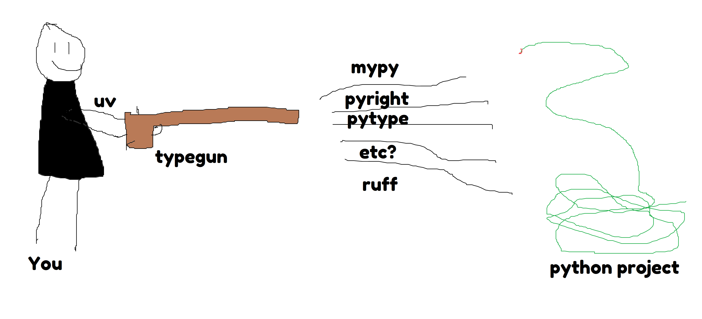

# typegun

> Special Gun Special\
—_Super Smash Bros. Ultimate_

Typegun is a small command-line utility for python to run a bunch of python typecheckers on a project, to see if there are any problems. This grew out of a script I would cart around, which I decided to make a reusable package. TODO: actually put it in here, and publish this package on pypi.

(For the purposes of typegun, by typechecker I mean static analysis tools only; Not a "runtime type checker", of which there are many in Python. A "semi-static" typechecker like pyanalyze or pycroscope would be allowable here as a static analysis tool.)

This only includes typecheckers that have a reasonable shot at typing near-current-version python projects mostly-correctly, in my (non-scientific) opinion, a list which may vary over time. If you'd like to add more or bicker about the configurations these typecheckers should have, I'm happy to hear it. The versions of these typecheckers are completely unpinned, all the better to get the most recent versions of them probably. It also includes [ruff](https://docs.astral.sh/ruff/), which is not a typechecker, but is very useful for code quality nonetheless.

Typegun is strategic about the order in which it runs its typecheckers, and this ordering is determined by the speed and utility of the typechecker. Ruff runs first because it runs very fast and never false-positives a type error at all, while still alerting you to other problems that may cause a type error, which the other typecheckers will detect more slowly later. Pyright runs second because it's fast and very correct to the python typing spec. Mypy runs after this because it's slower and has a couple typing problems. pytype runs last because it is slow and doesn't fully support Python 3.12 yet.

TODO: allow for custom behavior thru a typegun_special file or something.

TODO: allow for flexibility in what arguments/files the typecheckers are called on?

TODO: mypy daemon, faster storage with orjson?

## Example usage

In your project directory, do one of the following, depending on what you have installed already:

```typegun```

```uvx typegun```

```pipx run typegun```

```pip install typegun --break-system-packages && typegun```

etc etc

## Illustrative diagram


